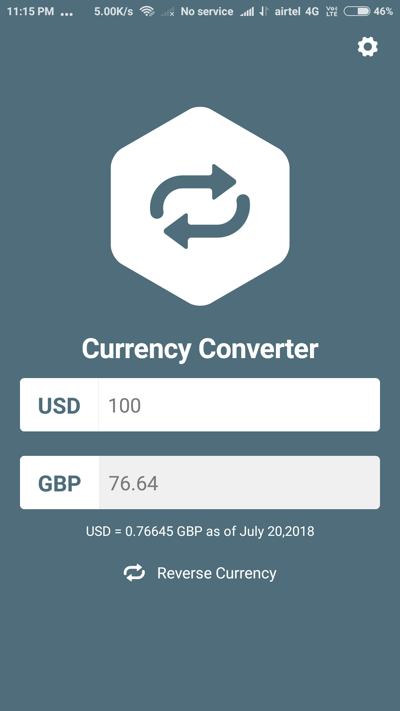
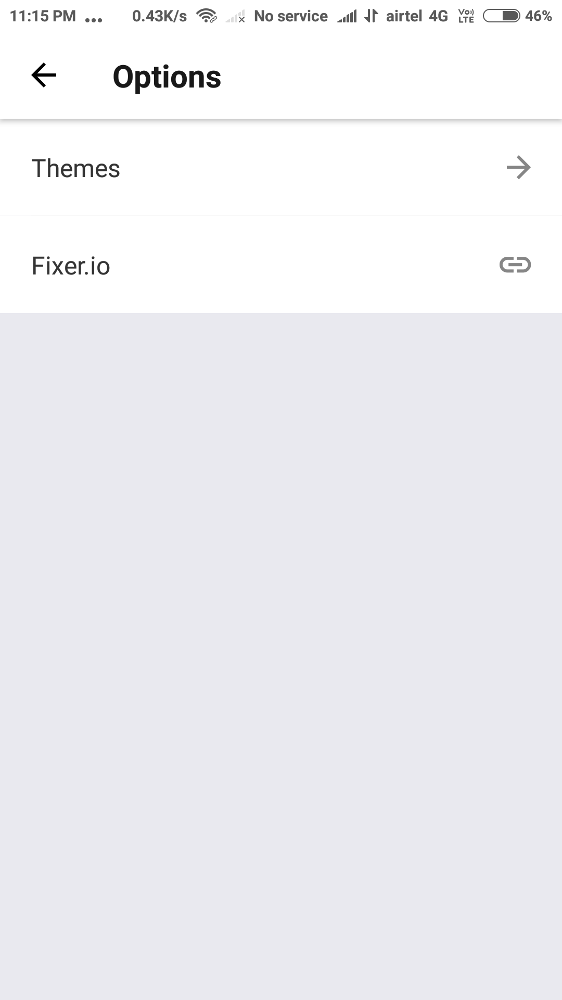
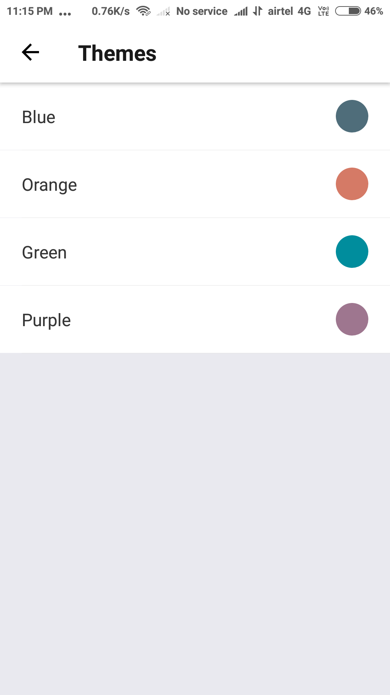
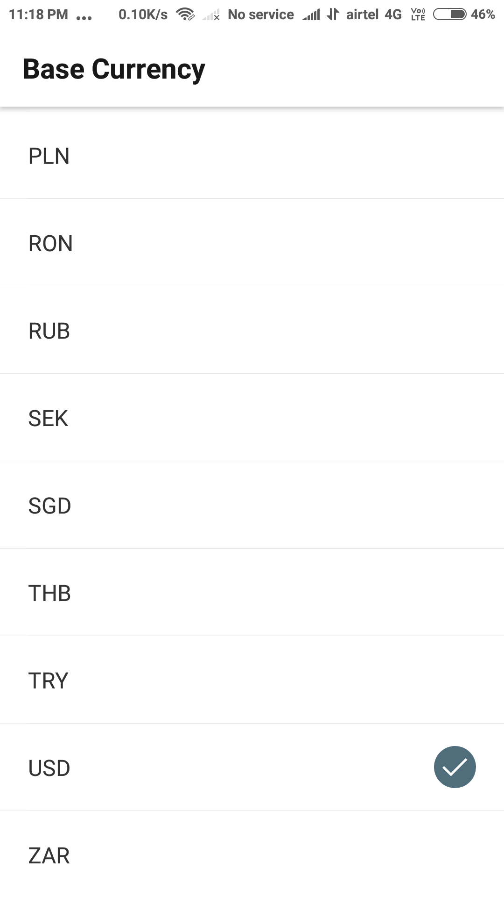
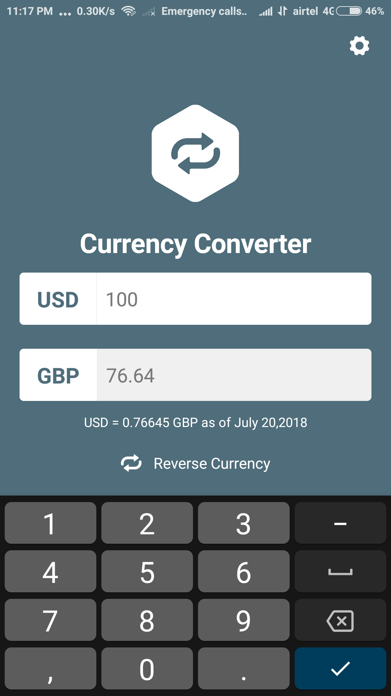
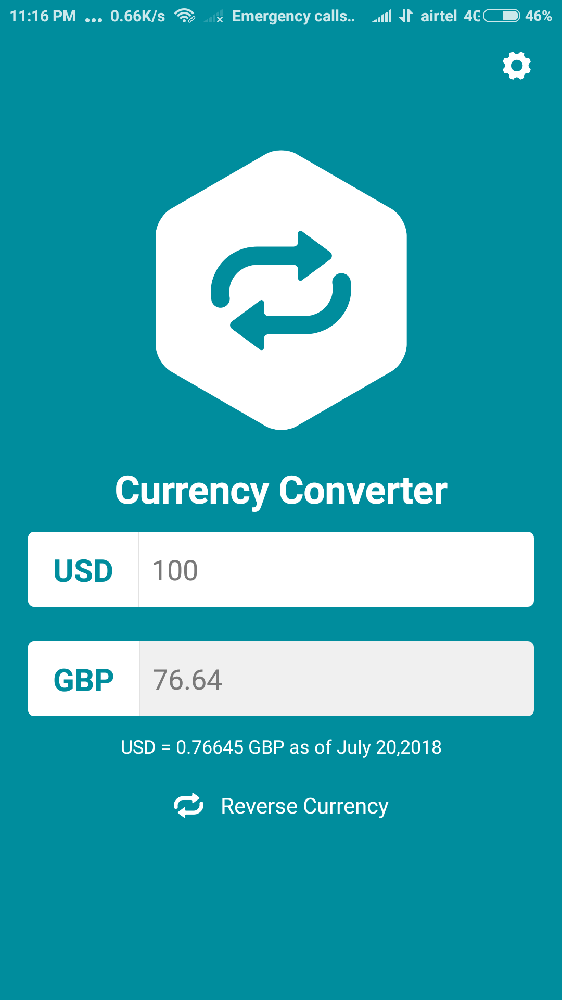
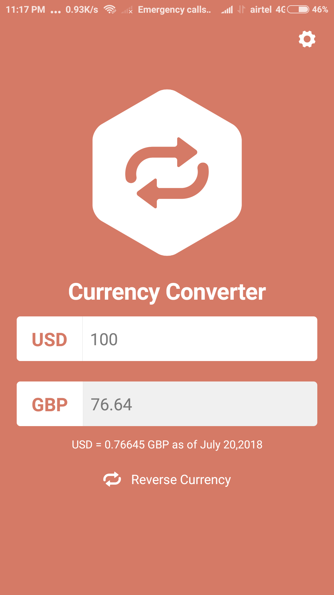
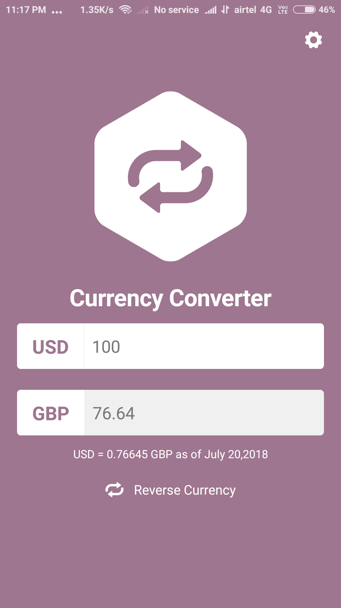

## React Native App for Currency Converter Using Fixer.io data  
React-Native, Redux, Redux-Thunk, Extended Stylesheet

Demo: https://expo.io/@anuragshas/currencyConverter

#### Screens:
<table>
  <tr>
    <td>
      MainScreen:
    </td>
    <td>
      OptionsScreen:
    </td>
    <td>
      ThemesScreen:
    </td>
    <td>
      CurrencySelector:
    </td>
  </tr>
  <tr>
    <td>
      
    </td>
    <td>
      
    </td>
    <td>
      
    </td>
    <td>
      
    </td>
  </tr>
</table>

<table>
  <tr>
    <td>
      KeyBoard Open:
    </td>
    <td>
      Green Theme:
    </td>
    <td>
      Orange Theme:
    </td>
    <td>
      Purple Theme:
    </td>
  </tr>
  <tr>
    <td>
      
    </td>
    <td>
      
    </td>
    <td>
      
    </td>
    <td>
      
    </td>
  </tr>
</table>
